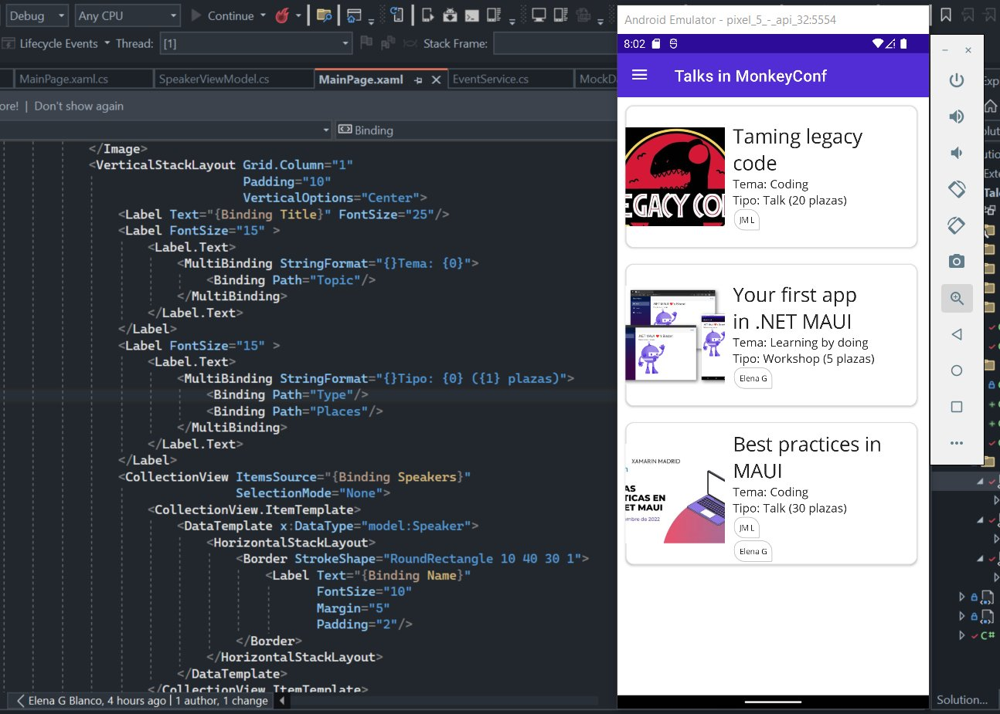

# TaleEngine on MAUI

Una app para gestionar eventos de comunidad

## Surfeando en Android con MAUI

Experimentando y aprendiendo sobre .NET MAUI

### Enlaces de utilidad

- [CommunityToolkit](https://github.com/communitytoolkit/dotnet?WT.mc_id=AZ-MVP-5003494)
- [MVVM toolkit sample app](https://apps.microsoft.com/store/detail/mvvm-toolkit-sample-app/9NKLCF1LVZ5H)
- [sqlite-net-pcl](https://www.nuget.org/packages/sqlite-net-pcl/)
- [XAML styleguide, buscando _contributors_](https://github.com/marcoablanco/XamlStyleGuide)
- [MVVM-S](https://www.youtube.com/watch?v=ve0DFu-arD8)
- [Inyección de dependencias](https://youtu.be/xx1mve2AQr4)
- [Validation rules](https://luismts.com/password-validation-rules-xamarin-forms/)
- [Azure DevOps for dotnet MAUI](https://devblogs.microsoft.com/dotnet/devops-for-dotnet-maui/)
- [Unit Testing .NET MAUI Apps with xUnit](https://youtu.be/C9vIDLQwc7M)
- About Linux
    - [dotnet MAUI Linux GitHub repository](https://github.com/jsuarezruiz/maui-linux)
    - [.NET MAUI: Soporte en Linux, por Javier Suarez en CampusMVP](https://youtu.be/6HZMaBjgoVs)

### Charlas sobre este repositorio

- [Dyplofest 2022](./doc/dyplofest2022.md)
- [XamarinMadrid, 28 de septiembre de 2022](./doc/xamarinmadrid2022sep.md)
- [dotnetmalaga 2022, 12 de noviembre de 2022](./doc/dotnetmalaga2022.md)

### Aprende más de .NET MAUI

Algunos canales de la comunidad MAUI:

- [Charlin Agramonte, XamGirl](https://xamgirl.com/)
- [Javier Suárez](https://www.youtube.com/c/JavierSu%C3%A1rezRuiz)
- [James Montemagno](https://www.youtube.com/c/JamesMontemagno)
- [Gerald on code](https://www.youtube.com/c/GeraldVersluis)
- [Jose Async](https://www.youtube.com/c/JoseAsync)

Documentación oficial:

- [.NET MAUI Workshop](https://aka.ms/maui-workshop/?WT.mc_id=AZ-MVP-5003494)
- [.NET MAUI Website](https://dotnet.microsoft.com/en-us/apps/maui/?WT.mc_id=AZ-MVP-5003494)
- [.NET MAUI Docs](https://docs.microsoft.com/dotnet/maui/?WT.mc_id=AZ-MVP-5003494)
- [.NET MAUI on Microsoft Learn](https://docs.microsoft.com/en-us/learn/paths/build-apps-with-dotnet-maui/?WT.mc_id=AZ-MVP-5003494)